XenDesktop Install
------------------

Overview
++++++++

In this exercise you will use Prism to deploy a Windows 2012 template image and install backend services for XenDesktop. For the purposes of simplifying the workshop, all key XenDesktop roles (Studio, Delivery Controller, StoreFront, Citrix Licensing) will be installed in a single VM. In a production environment these roles would be sepearated on multiple VMs to provide scalbility and high availability.

Additionally, you will install the MCS Plugin for AHV on the Delivery Controller VM. This plugin leverages the Citrix Provisioning SDK to allow Citrix Machine Creation Service to deploy and configure VMs running on Nutanix AHV. In a production environment the MCS Plugin would be deployed on each Delivery Controller VM.

Creating the VM
+++++++++++++++

In **Prism > VM > Table**, click **+ Create VM**.

Fill out the following fields and click **Save**:

- **Name** - XD
- **Description** - XenDesktop Delivery Controller, StoreFront, Citrix Licensing
- **vCPU(s)** - 4
- **Number of Cores per vCPU** - 1
- **Memory** - 6 GiB
- Select **+ Add New Disk**

  - **Operation** - Clone from Image Service
  - **Image** - Windows2012
  - Select **Add**
- Select **Add New NIC**

  - **VLAN Name** - Primary
  - **IP Address** - *10.21.XYZ.45*
  - Select **Add**
- Select **Custom Script**
- Select **Type or Paste Script**

.. literalinclude:: unattend.xml
   :caption: XD Unattend.xml Custom Script
   :language: xml

.. note::

  The Unattend script will change the hostname to **XD**, join the **NTNXLAB.local** domain, disable the Windows Firewall, and install Windows Remote Server Administration Tools (RSAT).

Select the **XD** VM and click **Power on**.

Select the **XD** VM and click **Manage Guest Tools**. Select **Enable Nutanix Guest Tools** and **Mount Nutanix Guest Tools**. Click **Submit**.

Nutanix Guest Tools are responsible for providing optimized device drivers for the guest operating system, as well as Self Service Restore and Volume Shadow Copy provider for application aware snapshots.

.. figure:: images/installxd1.png

.. note::

  Nutanix Guest Tools can also be mounted programmatically with nCLI. Using nCLI or connecting to <NUTANIX-CLUSTER-IP> via SSH:

  .. code::

      > ncli vm list | grep <VM-Name> -B 2
      > ncli ngt mount vm-id=<VM-Id>

Once the VM has started, click **Launch Console**.

In the **XD** VM console, launch **setup.exe** for the Nutanix Guest Tools installation.

.. figure:: images/installxd2.png

Accept the Nutanix End User Licensing Agreement and click **Install**.

Complete the installation, click **Close**, and reboot the VM.

.. note:: Nutanix Guest Tools can also be installed silently via command line using the following syntax:

  .. code::

      DRIVE:\> setup.exe /quiet ACCEPTEULA=yes

Installing XenDesktop
+++++++++++++++++++++

In **Prism > VM > Table**, select the **XD** VM and click **Update**.

Under **Disks**, eject any images currently attached to the **ide.0** CD-ROM device and select the **Pencil** icon to change the configuration.

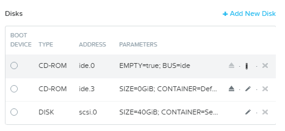

Fill out the following fields and click **Update**:

- **Operation** - Clone from Image Service
- **Image** - XenDesktop-7.15.iso

Click **Save**.

.. note::

  If not using a fully patched Windows 2012 R2 image, you will need to install Microsoft patch `KB2919355 <https://www.microsoft.com/en-us/download/details.aspx?id=42334>`_ before proceeding with XenDesktop installation (`CTX220340 <https://support.citrix.com/article/CTX220340>`_).

In the **XD** VM console, open the XenDesktop Installer and click the **Start** button to the right of **XenDesktop**.

.. figure:: images/installxd4.png

Click **Get Started**

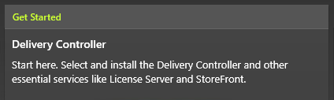

Accept the licensing agreement and click **Next**.

Select all components (Delivery Controller, Studio, Director, License Server, and StoreFront) and click **Next**.

The Delivery Controller service is the core component of a XenDesktop deployment, providing connection brokering and provisioning capabilities. Citrix Studio is the management UI, this role can also be installed on standalone systems for remote management. Citrix Director provides monitoring for the deployment. Citrix StoreFront provides the web front end of the connection broker and is responsible for delivering a consistent experience to users across endpoints, StoreFront can also be responsible for authenticating users against AD. See the :ref:`glossary` for additional details about each role.

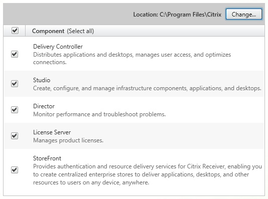

Select all features (Microsoft SWL Server 2014 Express, Windows Remote Assistance) and click **Next**.

In a production deployment you would use an external, highly available SQL Server instance to provide databases for site, monitoring, and logging operations. The XenDesktop installer provides a SQL Server Express instance for simple testing and POC purposes.

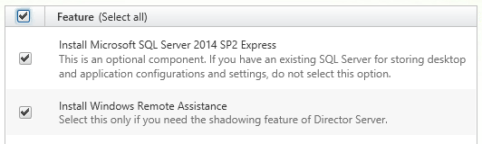

Select **Automatically** to allow the installer to configure the Windows Firewall service to allow traffic for selected XenDesktop components.

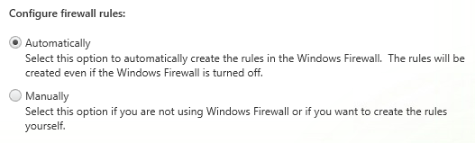

Review selections and click **Install**.

During installation of prerequisites you will be prompted to restart the VM, click **Close** and allow the VM to restart. After restart, log in as **NTNX\\Administrator** and the installation will continue.

.. figure:: images/installxd9.png

After installation, select **I do not want to connect to Smart Tools or Call Home** and click **Next**.

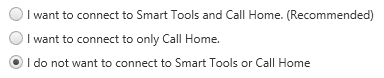

Click **Finish** to complete the installation.

.. figure:: images/installxd11.png

Installing MCS Plugin for AHV
+++++++++++++++++++++++++++++

By default, XenDesktop has support for provisioning virtual machines to a number of platforms, including: VMware vSphere, Microsoft Hyper-V, Citrix XenServer, Microsoft Azure, and AWS. The Citrix Provisioning SDK provides the ability to integrate additional platforms with the Delivery Controller's provisioning and power management functions, creating a native Citrix management experience on top of Nutanix AHV.

In the **XD** VM console, open a browser and download the following file: http://download.nutanix.com/firmware/citrix/1.1.3/NutanixAHV-MCS-XD7.9+or+later.msi

Open the installer and click **Next**.

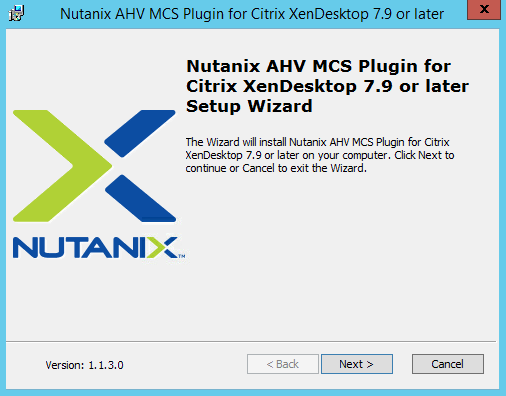

Select **I accept the terms in the License Agreement** and click **Next**.

Click **Next**.

Click **Install**.

Click **Finish**.

Configuring XenDesktop Site
+++++++++++++++++++++++++++

A XenDesktop Site is the name given to a deployed XenDesktop environment, comprised of Delivery Controllers, StoreFront servers, and virtual/physical desktops, and/or application servers. A Site can correspond to a geographical location, though it is not necessary.

In the **XD** VM console, open **Citrix Studio** from the Start Menu.

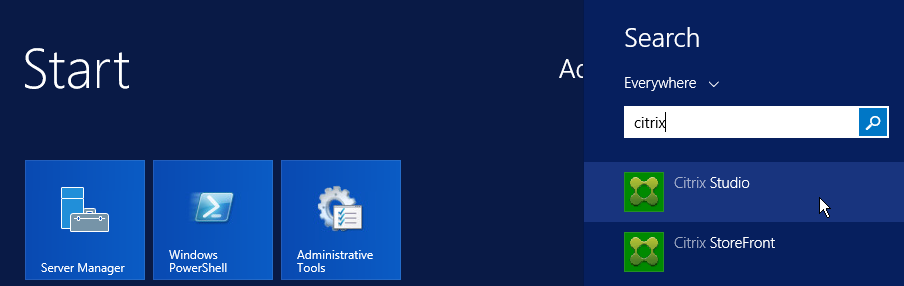

After launching Citrix Studio for the first time, you'll be prompted with three different options to configure your newly installed Delivery Controller. Click **Deliver applications and desktops to your users**.

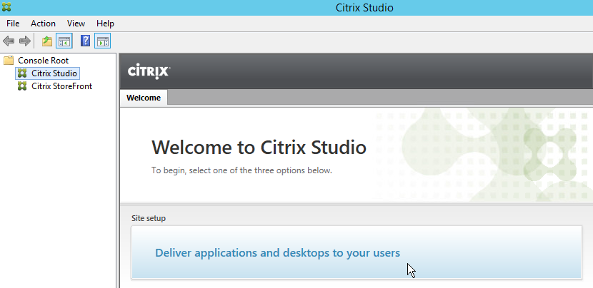

Fill out the following fields and click **Next**:

- Select **A fully configured, production-ready Site**
- **Site name** - Workshop

Observe the three separate databases being created and their locations, utilizing the local SQL Express instance we installed. Click **Next**.

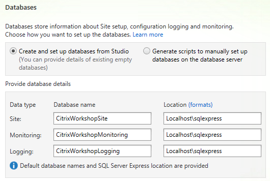

Select **Use the free 30-day trial** and click **Next**.

Fill out the following fields to configure the connection to your AHV cluster and click **Next**:

- **Connection Type** - Nutanix AHV
- **Connection Address** - 10.21.\ *XYZ*\ .37
- **User Name** - xd
- **Password** - nutanix/4u
- **Connection Name** - *Nutanix Cluster Name*
- Select **Studio tools (Machine Creation Services)**

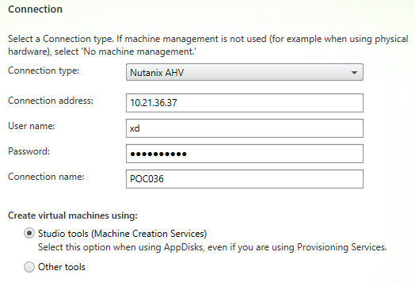

.. note::

  The local **xd** account has been created for you in Prism. Alternatively you could use an Active Directory service account, mapped to Prism as a **Cluster Admin**. It is not recommended to use the default 'admin' Prism account for authenticating to Prism from external services.

Fill out the following fields and click **Next**:

- **Name for these resources** - *Nutanix Cluster Name*
- Select **Secondary** network

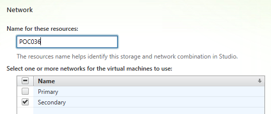

.. note::

  The **Secondary** network utilizes AHV's native IP Address Management capabilities to provide DHCP services that will be used by provisioned desktops and XenApp servers. To view the IPAM configuration, open **Prism > VM > Network Config > Virtual Networks**. DHCP settings can easily managed via Prism, and can be helpful in simplifying the deployment and management of large VDI environments.

The workshop will not explore Citrix's AppDNA or App-V Publishing features, so both can be left unselected before clicking **Next**.

Review selections and click **Finish** to start site creation.

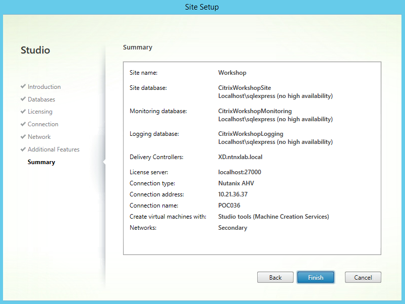

Once complete, Studio will indicate that configuration was successful.

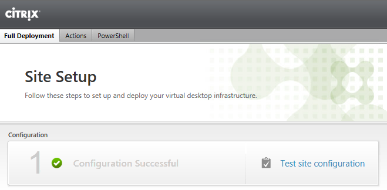

Selecting the **PowerShell** tab will detail all the steps taken by the Site Creation Wizard. After completing any task through the Studio UI you will see the PowerShell commands run in the background for each task.

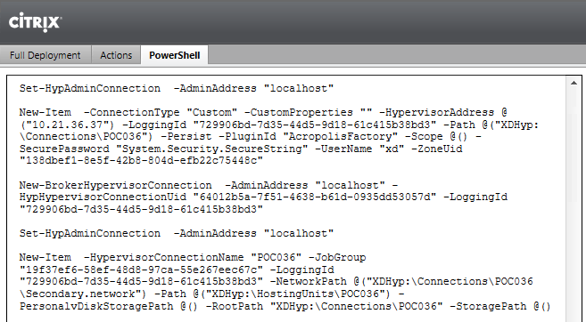

Enabling HTML5 Connections
++++++++++++++++++++++++++

XenDesktop has OS native clients for connecting to desktops and applications for all major platforms, including Windows, macOS, Linux, iOS, and Android. To reach even more devices, XenDesktop is also capable of delivering remote content via any HTML5-compliant browser. By default, these connections aren't allowed over non-secure (HTTP) sessions. As signed certificates will not be configured to enable HTTPS as part of the core Workshop, we will enable HTML5 connections over HTTP via the Citrix Policy engine.

Select **Citrix StoreFront > Stores**.

.. figure:: images/installxd21.png

Right-click **Store Service** and select **Manage Receiver for Web Sites**.

Click **Configure**.

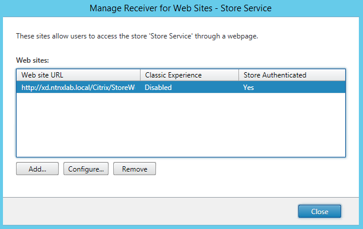

Click **Deploy Citrix Receiver** and select **Use Receiver for HTML5 if local Receiver is unavailable** from the dropdown menu.

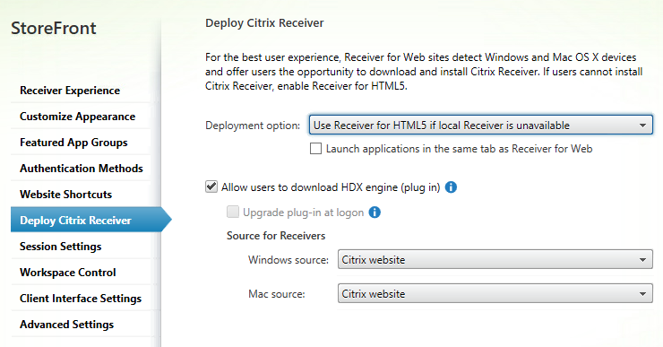

Click **OK > Close**.

Select **Citrix Studio > Policies**. Click **Close**

Right-click the **Unfiltered** policy and select **Edit Policy**.

Search for **WebSockets** and select the **WebSockets connections** setting. Click **Select**.

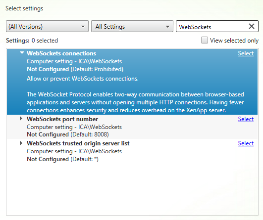

Select **Allowed** and click **OK**.

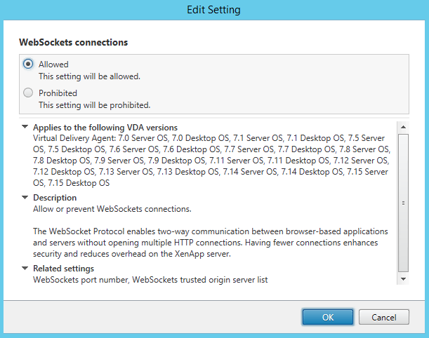

Click **Next > Finish**.

Enabling Receiver Unified Experience
++++++++++++++++++++++++++++++++++++

The following settings enable the native Citrix Receiver client to use the look and feel of the StoreFront web interface, which helps to create a standard experience regardless of how a user is accessing their desktops or applications. This is especially helpful when organizations make customizations to StoreFront.

Select **Citrix StoreFront > Stores**.

Right-click **Store Service** and select **Configure Unified Experience**.

Select **Set the unified Receiver experience as the default for this store** and click **OK**.

Takeaways
+++++++++

- Prism provides the ability to customize guests through standard VM creation workflow with support for injecting Sysprep and Cloud-Init scripts.

- The Nutanix MCS Plugin provides an integrated and fully supported experience for adding AHV clusters in Citrix Studio.

- Both Citrix and Nutanix support multiple hypervisors, including AHV, vSphere, Hyper-V, and XenServer. Choice of hypervisor and hardware platform with Nutanix prevents a business from being locked in to a single solution.

- The **acli** and **ncli** tools provide a programmatic interface for infrastructure and VM operations.

  .. note:: Nutanix also provides SDKs and fully documented APIs. See `developer.nutanix.com <http://developer.nutanix.com>`_ for API reference, code samples, and more. You can also find an interactive API Explorer within Prism under the <Username> drop down menu.
