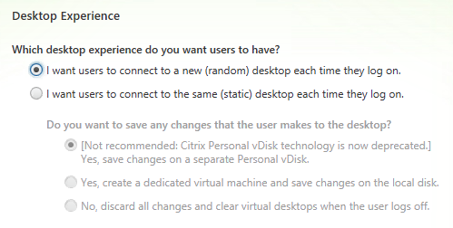
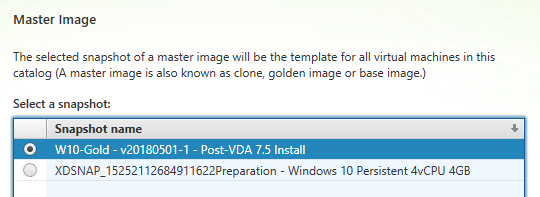
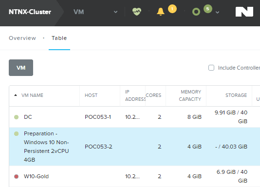
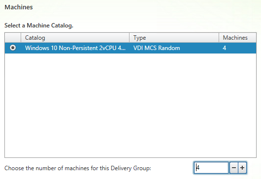
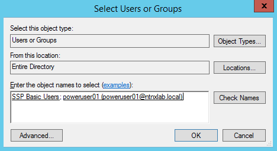
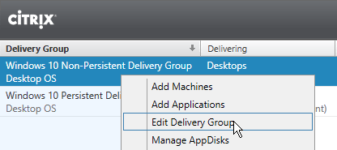
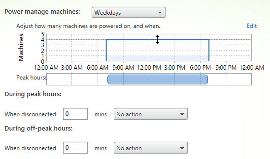
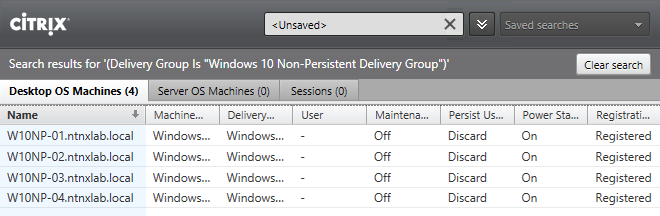
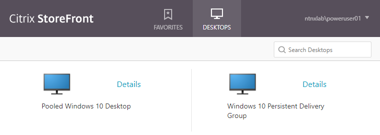

.. _npdesktops:

Delivering Non-Persistent Desktops
----------------------------------

Overview
++++++++

In this exercise you will use the Citrix Studio to deploy a pool of non-persistent virtual desktops based the same gold image as the previous lab exercise.

Creating the Machine Catalog
++++++++++++++++++++++++++++

In the **XD** VM console, open **Citrix Studio**.

Right-click **Machine Catalogs > Create Machine Catalog**.

Click **Next**.

Select **Desktop OS** and click **Next**.

Select **Machines that are power managed** and **Citrix Machine Creation Services (MCS)**. Click **Next**.

Select **I want users to connect to a new (random) desktop each time they log on** and click **Next**.

Select the **Default** Nutanix storage container and click **Next**.

Select your **W10-Gold** snapshot and click **Next**.

.. note::

  Note the XDSNAP* snapshot listed from the Preparation VM created by the persistent Machine Catalog previously. These snapshots will continue to exist as long as there are provisioned virtual desktops utilizing them.

Fill out the following fields and click **Next**:

- **How many virtual machines do you want to create** - 4
- **Total memory (MB) on each machine** - 4096
- **Virtual CPUs** - 2
- **Cores per vCPU** - 1

Fill out the following fields and click **Next**:

- Select **Create new Active Directory accounts**
- Select **Non-PersistentDesktop** OU
- **Account naming scheme** - W10NP-##

.. figure:: images/npdesktops3.png

Specify a friendly, descriptive **Machine Catalog name** (e.g. **Windows 10 Non-Persistent 2vCPU 4GB**) and click **Finish**.

MCS will now create a clone from the snapshot of **W10-Gold** and follow a similar preparation process as the in the previous exercise.

Upon completion, view the details of the Machine Catalog in **Citrix Studio**.

Note the clones exist in **Prism** but are not powered on. Select one of the VMs and observe both the OS vDisk and ID disk attached to the VM on the **Virtual Disks** tab below the VMs table. Similar to the persistent Machine Catalog, each VM appears to have its own unique read/write copy of the gold image. With VMs in a Machine Catalog spanning several Nutanix nodes, data locality for VM reads is provided inherently by the Unified Cache.

This MCS implementation is unique to AHV. For non-persistent Machine Catalogs, other hypervisors link to the base golden image for reads and apply writes to a separate disk, referred to as a differencing disk. In these scenarios, Nutanix Shadow Clones are used to provide data locality for VM reads. Shadow Clones is a feature that automatically provides distributed caching for multi-reader vDisks.

.. note:: To learn about MCS provisioning in greater detail, see the following articles:

  - `Citrix MCS for AHV: Under the hood <http://blog.myvirtualvision.com/2016/01/14/citrix-mcs-for-ahv-under-the-hood/>`_
  - `Citrix MCS and PVS on Nutanix: Enhancing XenDesktop VM Provisioning with Nutanix  <http://next.nutanix.com/t5/Nutanix-Connect-Blog/Citrix-MCS-and-PVS-on-Nutanix-Enhancing-XenDesktop-VM/ba-p/3489>`_

  To learn more about how Nutanix implements Shadow Clones, see the `Shadow Clones <http://nutanixbible.com/#anchor-shadow-clones-79>`_ section of the Nutanix Bible.

Creating the Delivery Group
+++++++++++++++++++++++++++

Right-click **Delivery Groups > Create Delivery Group**.

Click **Next**.

Select your **Non-Persistent** Machine Catalog and specify the maximum number of VMs available for the Delivery Group.

Select **Restrict use of this Delivery Group to the following users** and click **Add**.

Specify **SSP Basic Users** and **poweruser01** in the **Object names** field and click **OK**.

Click **Next**.

.. note:: #TODO Add note about seamless applications and link to XenApp lab

Click **Next**.

Click **Add** and fill out the following fields:

- **Display name** - Pooled Windows 10 Desktop
- **Description** - Non-Persistent 2vCPU/4GB RAM Windows 10 Virtual Desktop
- Select **Allow everyone with access to this Delivery Group**
- Select **Enable desktop assignment rule**

Click **OK > Next**.

Specify a friendly name (e.g. **Windows 10 Non-Persistent Delivery Group**) for the Delivery Group and click **Finish**.

Following creation of the pool, observe in **Prism** that 1 of the **W10NP-##** VMs been has powered on.

In **Citrix Studio**, right-click your Delivery Group and click **Edit Delivery Group**.

Select **Power Management** from the sidebar.

Click and drag the number of machines powered on during peak hours from 1 to 4. The peak hours period can optionally be modified by clicking and dragging to either the left or the right.

.. note:: For more granular control of registered, powered on VMs you can click the Edit link and provide the number or percentage of VMs you want available for every hour of the day. You can also configure the disconnected VM policy to free up disconnected VMs after a configurable time out period, returning the desktop to the pool for another user.

After increasing the number of powered on virtual machines, validate the **W10NP-##** VMs are powered on in **Prism** and appear as Registered in **Citrix Studio**.

Connecting to the Desktop
+++++++++++++++++++++++++

Open **\http://<XD-VM-IP>/Citrix/StoreWeb** in a browser on the same L3 LAN as your XD VM.

Log in as:

- **Username** - NTNXLAB\\poweruser01
- **Password** - nutanix/4u

Select the **Desktops** tab and observe both your **Personal Windows 10 Desktop** and a **Pooled Windows 10 Desktop** are available. Click the **Pooled** desktop to launch the session.

After the virtual desktop has completed logging in, experiment by changing application settings, installing applications, restarting the VM, and logging in again. Try logging in as **basicuser01**, any differences?

Takeaways
+++++++++

- With MCS, a single gold image can be used for both persistent and non-persistent Machine Catalogs.

- Non-persistent virtual desktops provide a consistent experience as the user is getting a "fresh" VM upon every login. This approach can provide significant operation savings over traditional software patching, but will likely require other tools to provide needed customization on top of the non-persistent desktop. Use cases such as kiosks or educational labs can be a great fit for "vanilla" non-persistent desktops.

- Despite being based off of a single, shared, gold image, all the VMs in the Machine Catalog continue to benefit from data locality (reduced latency for reads and reduced network congestion). For non-AHV hypervisors, the same benefit is realized through Shadow Clones.
