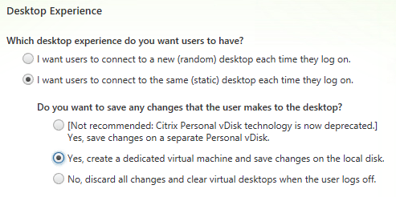
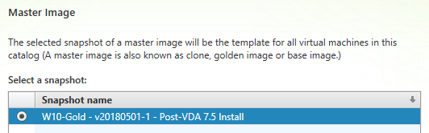
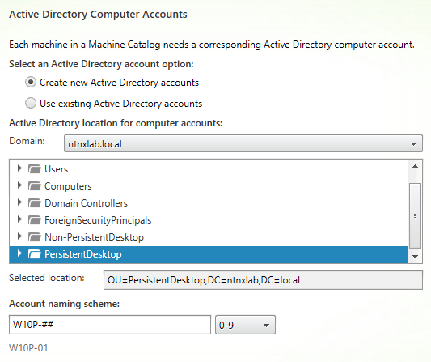
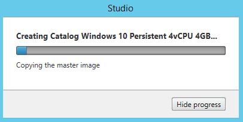
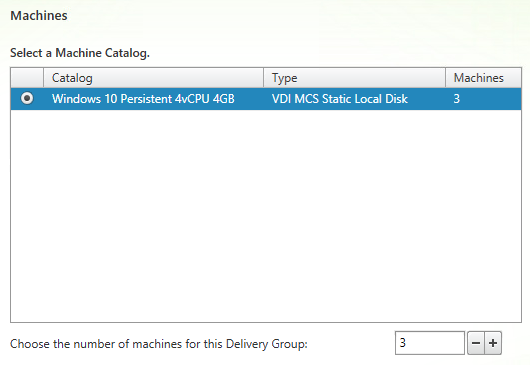
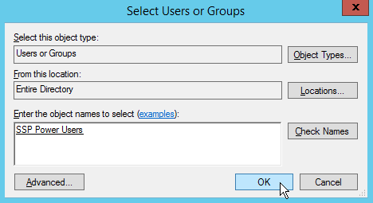
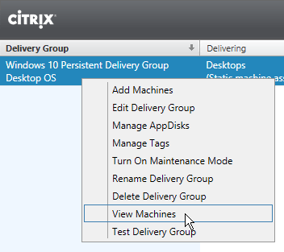
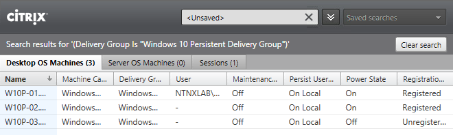

Delivering Persistent Desktops
------------------------------

Overview
++++++++

In this exercise you will use the Citrix Studio to deploy multiple persistent virtual desktops based on your gold image snapshot. You will explore two important constructs within a XenDesktop architecture, Machine Catalogs and Delivery Groups.

Creating the Machine Catalog
++++++++++++++++++++++++++++

Machine Catalogs are collections of either physical or virtual machines. When using MCS or PVS to provision a Machine Catalog from a gold image, all machines provisioned from that image will share the same VM configuration (vCPUs, Memory, Network) and be part of the same domain. A single gold image can be used for multiple Machine Catalogs to provide different size VMs, VMs across multiple domains, etc.

In the **XD** VM console, open **Citrix Studio**.

Right-click **Machine Catalogs > Create Machine Catalog**.

.. figure:: images/pdesktops1.png

Click **Next**.

Select **Desktop OS** and click **Next**.

Select **Machines that are power managed** and **Citrix Machine Creation Services (MCS)**. Click **Next**.

Select **Static** and **Yes, create a dedicated virtual machine**. Click **Next**.

Select the **Default** Nutanix storage container and click **Next**.

Select your **W10-Gold** snapshot and click **Next**.

Fill out the following fields and click **Next**:

- **How many virtual machines do you want to create** - 3
- **Total memory (MB) on each machine** - 4096
- **Virtual CPUs** - 4
- **Cores per vCPU** - 1

Fill out the following fields and click **Next**:

- Select **Create new Active Directory accounts**
- Select **PersistentDesktop** OU
- **Account naming scheme** - W10P-##

As part of Machine Catalog creation, the Delivery Controller will create all of the machine accounts in AD. This is necessary as the cloned VMs themselves do not go through a traditional Sysprep and domain join. Instead, the Citrix Machine Identity Service (installed as part of the VDA), manages the VM's "uniqueness," providing a more rapid means of provisioning large pools of desktop resources.

Specify a friendly, descriptive **Machine Catalog name** (e.g. **Windows 10 Persistent 4vCPU 4GB**) and click **Finish**.

MCS will now create a clone from the snapshot of **W10-Gold**. When using MCS, the Delivery Controller copies the gold image to each configured datastore in the Host Connection. In a traditional SAN scenario (or using MCS with local storage) this can be a time consuming event, as the Machine Catalog may be spread over several volumes to achieve the desired performance. In a Nutanix cluster you would typically have a single datastore (Storage Container) servicing all desktops, simplifying the configuration and improving the time to provision a Machine Catalog.

Observe the Preparation clone booting in **Prism** briefly before shutting down and being removed automatically. Attached to this VM is a separate disk that walks through multiple steps to ensure the VM is ready to be used for the Machine Catalog.

The preparation stage will enable DHCP, perform a Windows licensing "rearm" to ensure it is reported to the Microsoft KMS server as a unique VM, and similarly perform an Office licensing "rearm". Studio will automatically create a snapshot of the VM in this state once it has completed preparation and shut down.

.. figure:: images/pdesktops6.png

MCS will now create the VMs for our Machine Catalog. This involves the creation of the VMs and the cloned base vDisk, as well as the creation of a small (16MB maximum) vDisks called the Identity (ID) disks. The ID disk contains information unique to each VM that provides its hostname and Active Directory Machine Account Password. This information is ingested automatically by the Citrix Machine Identity Service and allows the VM to appear as unique and allowing it to join the domain.

.. figure:: images/pdesktops7.png

Observe the clones exist in **Prism** but are not powered on. Select one of the VMs and observe both the OS vDisk and ID disk attached to the VM on the **Virtual Disks** tab below the VMs table. Each VM appears to have its own unique read/write copy of the gold image. With VMs in a Machine Catalog spanning several Nutanix nodes, data locality for VM reads is provided inherently by the Unified Cache.

.. note:: To learn more about how the Nutanix Unified Cache operates, see the `I/O Path and Cache <http://nutanixbible.com/#anchor-i/o-path-and-cache-65>`_ section of the Nutanix Bible.

.. figure:: images/pdesktops8.png

Upon completion, view the details of the Machine Catalog in **Citrix Studio**.

.. figure:: images/pdesktops9.png

Creating the Delivery Group
+++++++++++++++++++++++++++

Delivery Groups are collections of machines from one or more Machine Catalogs. The purpose of a Delivery Group is to specify what users or groups can access the machines. For persistent desktops a permanent relationship is created between the machine and the user account. This assignment can occur either manually during creation of the Delivery Group or be assigned automatically during a user's first logon.

Right-click **Delivery Groups > Create Delivery Group**.

.. figure:: images/pdesktops10.png

Click **Next**.

Select your **Persistent** Machine Catalog and specify the maximum number of VMs available for the Delivery Group.

Select **Desktops** and click **Next**.

Select **Restrict use of this Delivery Group to the following users** and click **Add**.

Specify **SSP Power Users** in the **Object names** field and click **OK**.

Click **Next**.

Click **Add** and fill out the following fields:

- **Display name** - Personal Windows 10 Desktop
- **Description** - Persistent 4vCPU/4GB RAM Windows 10 Virtual Desktop
- Select **Allow everyone with access to this Delivery Group**
- **Maximum desktops per user** - 1
- Select **Enable desktop assignment rule**

Click **OK > Next**.

Specify a friendly name (e.g. **Windows 10 Persistent Delivery Group**) for the Delivery Group and click **Finish**.

Following creation of the pool, observe in **Prism** that 1 of the **W10P-##** VMs been has powered on.

In **Citrix Studio**, right-click your Delivery Group and click **View Machines**. Alternatively you can double-click on the name of the Delivery Group.

Observe the powered on desktop soon appears as **Registered** with the Delivery Controller, indicating the desktop is ready for user connection.

Connecting to the Desktop
+++++++++++++++++++++++++

Open **\http://<XD-VM-IP>/Citrix/StoreWeb** in a browser on the same L3 LAN as your XD VM.

If prompted, click **Detect Receiver**.

.. figure:: images/pdesktops14.png

If Citrix Receiver is not installed, select **Use light version** to connect to the desktop session via HTML5.

Log in as:

- **Username** - NTNXLAB\\poweruser01
- **Password** - nutanix/4u

Select the **Desktops** tab and click your **Personal Windows 10 Desktop** to launch the session.

.. figure:: images/pdesktops15.png

.. note::

  *If using Receiver to connect to your desktop* - Depending on your browser you may have to click on the downloaded .ica file if Receiver does not open automatically. You may also be able to instruct the browser to always open .ica files.

  *If using HTML5 to connect to your desktop* - If your desktop does not launch, ensure that pop-ups aren't being blocked by your browser.

After the virtual desktop has completed logging in, experiment by changing application settings, installing applications, restarting the VM, and logging in again.

In **Citrix Studio**, observe the changes to VM details. As a user logs in they are statically assigned a desktop and another desktop will power on and register with the Delivery Controller, waiting for the next user.

Takeaways
+++++++++

- Citrix is capable of delivering a high-fidelity desktop experience via HTML5. Simiarly, the HTML 5 Nutanix Prism interface provides a single UI for managing and monitoring your infrastructure from anywhere.

- The ability to support a large environment from a single storage container simplifies configuration and improves deployment speed.

- Despite being based off of a single, shared, gold image, all the VMs in the Machine Catalog continue to benefit from data locality (reduced latency for reads and reduced network congestion). For non-AHV hypervisors, the same benefit is realized through Shadow Clones.

- Intelligent cloning avoids significant storage overhead for deploying persistent virtual desktops. If mixing persistent and non-persisdent desktops within the same cluster, best practice would be to leverage a storage container with deduplication enabled for persistent desktops and a separate storage container with deduplication disabled for non-persistent desktops. Having the flexibility to pair workloads with appropriate storage efficiency technologies can imrpvoe density and reduce waste.

- Citrix MCS allows for end to end provisioning and entitlement management in a single console.

- Persistent virtual desktops provide a traditional desktop-like experience where a user can have full control over their desktop experience. This approach may be necessary for a small subset of users but typically isn't desirable at scale due to the continued dependence on legacy software patching tools.
