Testing Environment Resiliency
------------------------------

Overview
++++++++

.. note::

  **THIS LAB REQUIRES ACCESS TO A PHYSICAL CLUSTER AND IS NOT CURRENTLY SUPPORTED WITH "NESTED" HOSTED POC CLUSTERS.**

In this exercise you will explore and configure AHV's High Availability (HA) and Acropolis Dynamic Scheduling (ADS) features. You will also fail a node with active connections to your virtual desktops and observe the environment's behavior during failure.

If you're interested in additional real world system testing, Nutanix has produced an automated system test suite, X-Ray. X-Ray is designed to evaluate hyperconverged infrastructure platforms in a variety of scenarios, including: Database co-location (workload interference), snapshot impact, rolling upgrades, node failures, and workload simulations.

Learn more and get started with X-Ray at http://www.nutanix.com/xray/

Updating CVM Firewall Rules
+++++++++++++++++++++++++++

In order to access the internal Curator diagnostic page from outside of the Controller VM subnet, we'll need to open TCP port 2010 in the CVM firewall.

Using an SSH client, execute the following:

.. code:: bash

  > ssh nutanix@<NUTANIX-CLUSTER-IP>
  > allssh "sudo iptables -t filter -A MGMT_OPENFROMALL -p tcp -m tcp --dport 2010  -j ACCEPT"

Configuring VM Affinity
+++++++++++++++++++++++

In **Prism > VM > Table**, select **XD**. In the **Host** column, observe the host the **XD** VM is currently running on. Click **Update**.

.. figure:: images/resiliency1.png

Under **VM Host Affinity**, click **Set Affinity**.

Select Host 1 and Host 2 and click **Save > Save**.

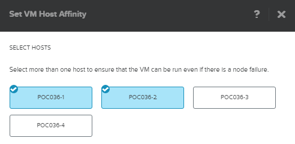

If your VM wasn't already running on Node 1 or 2, observe that it was automatically live migrated after updating the affinity policy.

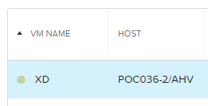

Repeat these steps for **DC** and any other applicable non-AFS or non-desktop VMs (**PC**, etc.).

Enabling HA Memory Reservation
++++++++++++++++++++++++++++++

By default, Nutanix AHV will protect VMs in the event of a node failure on a best effort basis, presuming there is adequate memory availability to restart VMs from the failed host. Enabling HA forces a dynamic memory reservation to ensure memory availability in the event of a node failure. It will also validate there are no affinity rules that would prevent HA from being enabled, for instance a VM with a host affinity policy only containing a single host.

In **Prism**, click :fa:`cog` **> Manage VM High Availability**

Select **Enable HA** and click **Save > OK**.

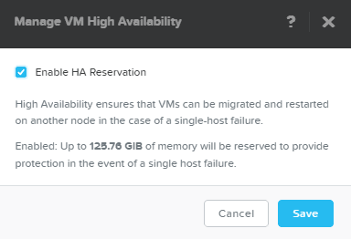

.. note:: Increased failures to tolerate, such as in the case of an RF3 cluster wanting to tolerate 2 node failures, can be defined via acli.

  .. code::

    > acli  ha.update num_host_failures_to_tolerate=2

  Restart priority for individual VMs can be defined via acli. A negative value disables HA restart for that VM.

  .. code::

    > acli vm.update <VM NAME> ha_priority=1000

Staging Connections
+++++++++++++++++++

Log in to Citrix StoreFront as **NTNXLAB\\poweruser01** and launch both your **Pooled** and **Personal** desktops.

In **Citrix Studio > Search > Sessions**, click **Clear Search** and note the VM Names of **poweruser01**'s sessions.

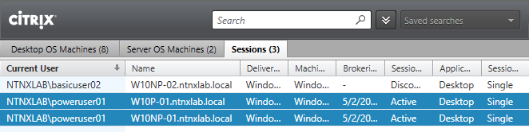

In **Prism > VM > Table**, search for each of **poweruser01**'s VMs. Validate whether or not the VM is currently running on Host 3, if not, select the VM and click **Migrate**.

Select Host 3 from the **Host** drop down menu and click **Migrate**.

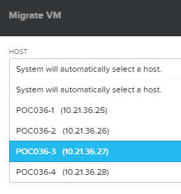

Repeat these steps to ensure the second VM is also on Host 3.

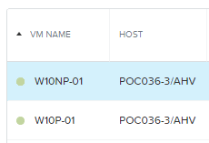

Executing Order 66
++++++++++++++++++

.. note:: If you're using a non-NX Nutanix platform you will need to consult manufacturer documentation for your hardware platform for instruction on accessing the out-of-band management and powering off the node.

In **Prism > Hardware > Table**, select Host 3. In the **Host Details** table, click the **IPMI IP** link.

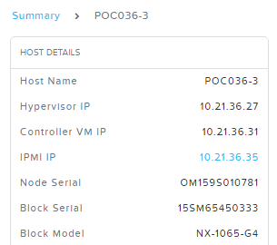

Log in as:

- **Username** - ADMIN
- **Password** - ADMIN

Select **Power Control** from the **Remote Control** drop down menu.

.. figure:: images/resiliency9.png

Select **Power Off Server - Immediate** and click **Perform Action**.

.. figure:: images/resiliency10.png

Immediately you'll observe that both of your Citrix Receiver sessions have been interrupted. Close both of them.

Log in to Citrix StoreFront again as **NTNXLAB\\poweruser01** and launch a **Pooled** desktop. You will be able to connect to another desktop immediately, complete with your profile and user data if configured.

In **Citrix Studio**, verify that the desktop to which you're now connected is not the same VM to which you were previously connected.

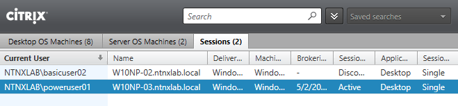

In **Prism > Tasks**, the node failure has been detected and VMs have already begun to power on on the remaining nodes in the cluster. In the screenshot below we can see our **Personal Windows 10 Desktop** has already been powered on on Node 2.

.. figure:: images/resiliency12.png

In **Citrix Studio > Search > Desktop OS Machines**, verify your **Personal Windows 10 Desktop VM** now appears as Registered with the Delivery Controller.

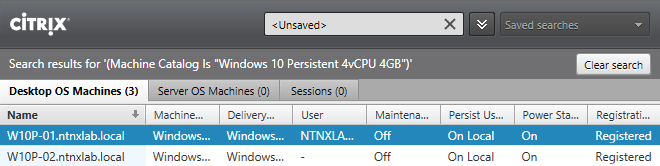

Return to Citrix StoreFront and launch your **Personal Windows 10 Desktop**. Verify that the desktop logs in successfully.

In **Prism > Home**, verify that the cluster is in Critical Status and that a rebuild is in progress.

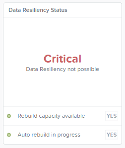

Open **\https://<NUTANIX-CLUSTER-IP>:2010** in your browser and click the **Curator Master** link.

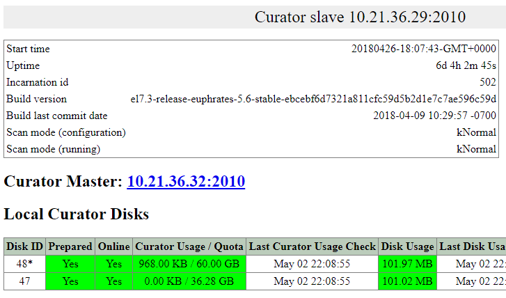

Verify that Node 3 is down and that a **Partial Scan** due to a **Node Failure** has generated many background tasks. Click the **Execution ID** link associated with this job for more details.

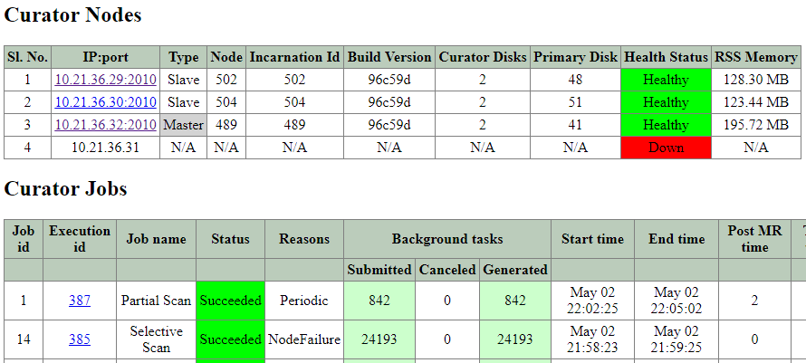

The majority of the jobs associated with the scan are to replicate missing extents, data that was present and no longer available on Host 3.

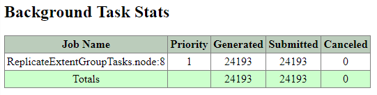

Restoring Balance to the Force
++++++++++++++++++++++++++++++

In your browser, return to the out-of-band management (IPMI) console **> Remote Control > Power Control**.

Select **Power On Server** and click **Perform Action**.

.. figure:: images/resiliency18.png

After several minutes, giving time for the host and CVM to boot, verify in **Prism > Home** that **Data Resiliency Status** has returned to **OK**.

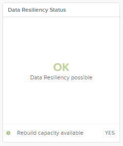

**Health** still appears as critical, this is normal following a CVM reboot as an unexpected CVM reboot could be indicative of an issue with the cluster. After a short period of time the Health will update itself.

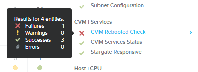

In **Prism > VM > Table**, filter by the Node 3 hostname and note that the majority of VMs that had previously been running on Node 3 have returned to running on this node.

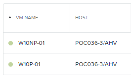

Restore CVM firewall to default configuration:

.. code:: bash

  > ssh nutanix@<NUTANIX-CLUSTER-IP>
  > allssh "sudo service iptables start"; done

Verify you're no longer able to access the Curator page from your browser.

Takeaways
+++++++++

- Nutanix begins re-protecting missing extents as soon as a disk or node failure is detected.

- Nutanix does not risk data loss by only writing a single copy of data during failure scenarios and will continue to write new data in accordance with the Storage Container Replication Factor (RF) policy.

- AHV supports affinity rules to accomodate VM to Host scenarios (e.g. tying a VM to a subset of hosts for software licensing purposes), as well as VM to VM anti-affinity scenarios (e.g. separating multiple XenDesktop Delivery Controller VMs for high availability).

- HA and ADS are enabled by default.

- ADS goes above and beyond CPU and memory congestion avoidance when making decisions about VM placement. AHV has visibility into the storage stack as well, allowing VM placement decisions to also account for factors such as SSD utilization and data locality.

- Unlike RAID based solutions, Nutanix can fully self-heal without administative intervention following a node or disk failure provided there is adequate compute and storage availability.
