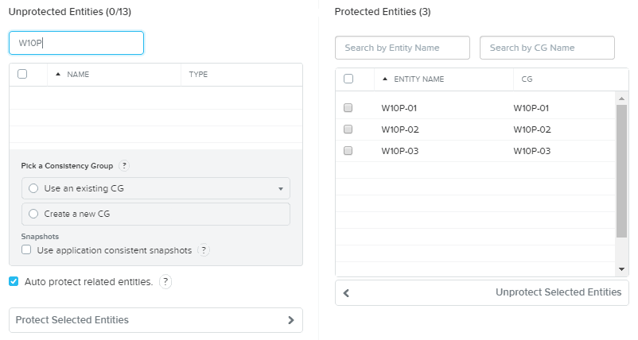
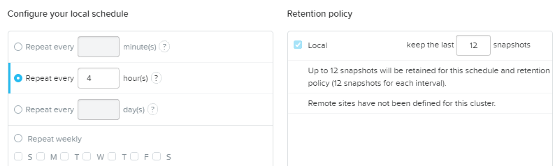
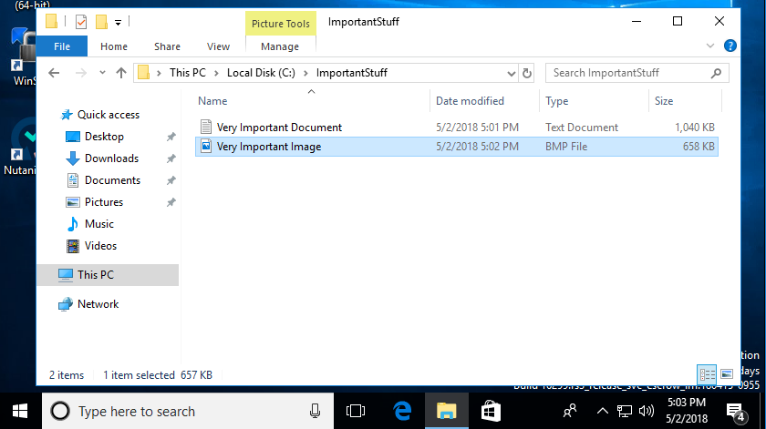
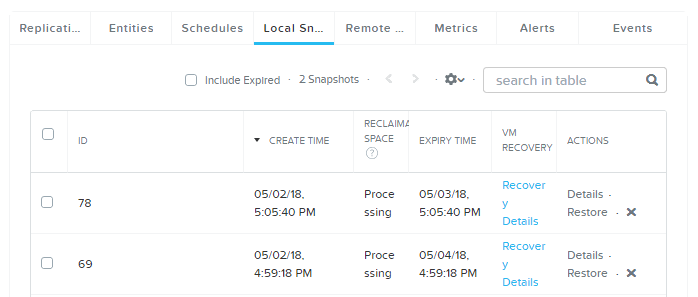
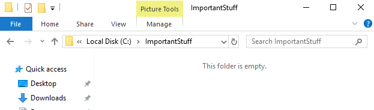
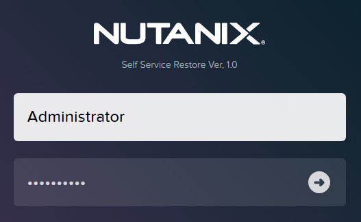
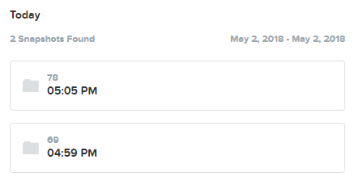
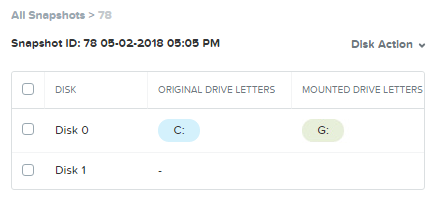
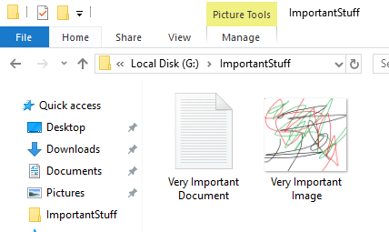

.. _ssflr_lab:

Self-Service File Level Restore
-------------------------------

Overview
++++++++

In this exercise you will configure native Nutanix snapshots for your persistent virtual desktops and test restoring deleted files as an end user using Nutanix Self Service Restore.

Protecting the VMS
++++++++++++++++++

Nutanix provides native backup and replication capabilities to support DR workflows. Snapshots can be taken, cloned, and restored at the per VM or virtual disk level, allowing granular operations. To simplify applying snapshot schedule, retention policy, and replication policy, VMs can be grouped into Protection Domains. Within a Protection Domain, VMs can be combined into Consistency Groups. Consistency Groups ensure all VMs within the group are snapshot at the same time. Protection Domains can also be used to perform application consistent snapshots using either the hypervisor's VSS provider, or the Nutanix Guest Tools VSS provider.

In **Prism > Data Protection**, click **+ Protection Domain > Async DR**.

.. figure:: images/ssflr1.png

Specify a **Name** for the Protection Domain (e.g. **Persistent-Desktops**) and click **Create**.

Select all **W10P-##** VMs and click **Protect Selected Entities > Next**.

Click **New Schedule** and fill out the following fields:

- **Repeat every X hour(s)** - 4
- **Keep the last X snapshots** - 12

Click **Create Schedule > Close**.

Staging the Test
++++++++++++++++

Log in to Citrix StoreFront again as **poweruser01** and launch your **Personal** desktop. Create some new directories and files (e.g. downloading images, creating text documents, etc.) as shown below.

In **Prism > Data Protection > Table**, select the **Persistent-Desktops** Protection Domain.

Select the **Local Snapshots** tab and observe that there is already 1 snapshot present that was taken when the Protection Domain was created. Click **Take Snapshot** to manually perform a snapshot of the Protection Domain outside of the configured 4 hour schedule.

As the snapshot isn't being replicated to a remote site we don't need to alter **Replication Start Time**. Select a **Retention Time** of **1 day** and click **Save**.

There is now an additional local snapshot available.

Self Service Restore needs to be enabled as a feature of Nutanix Guest Tools. In **Prism > VM > Table**, select **poweruser01**'s **W10P-##** and make the following selections:

- Select **Enable Nutanix Guest Tools**
- Select **Mount Nutanix Guest Tools**
- Select **Self Service Restore (SSR)**

Click **Submit**.

In the **poweruser01 Personal** desktop session, reboot the VM.

Performing Self Service Restore
+++++++++++++++++++++++++++++++

Log in to Citrix StoreFront again as **poweruser01** and launch your **Personal** desktop. Delete the files you had previously created.

Launch **Nutanix SSR** from the desktop.

.. note:: Alternatively you can access the SSR UI by opening http://localhost:5000 in a browser.

Log in as:

- **Username** - Administrator
- **Password** - nutanix/4u

.. note::

  In order to access Nutanix SSR, the user needs to be part of the local Administrators group. In a typical production environment you could use Group Policy to make the user assigned to a Persistent virtual desktop a local Administrator.

  The credentials used for Nutanix SSR do not need to be that of the currently logged in user.

Select the most recent snapshot *prior* to deleting your files.

Select **Disk 0** and click **Disk Action > Mount**.

Note the drive letter used for the mounted snapshot.

In **File Explorer**, browse to the location of your files on the mounted snapshot drive.

Copy and paste the files back to their original location on the C: drive. Return to the Nutanix SSR console and select **Mounted Snapshots** from the navigation bar. Select **Disk 0** and click **Disk Action > Unmount**.

Takeaways
+++++++++

- Nutanix provides native snapshot and replication capabilities that can be configured at the individual VM level. Cluster to cluster replication is a key component in enabling DR for VDI components such as gold images and persistent virtual desktops.

- Self-Service File Level Restore allows an end user to restore deleted or previous versions of files without storage or backup admin engagement. This may be applicable for persistent desktop users who may inadvertently store files in local directories.

- Self-Service File Level Restore mounts the native disk directly to the guest VM, preserving the original filesystem and security ACLs.
