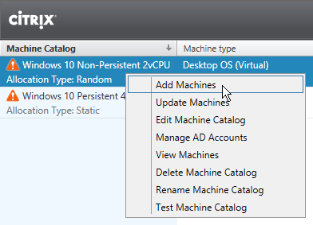
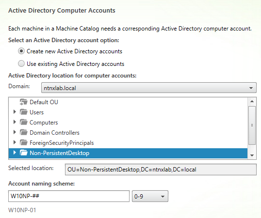
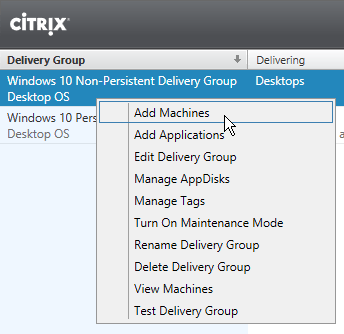
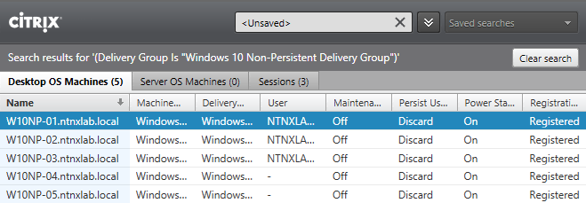
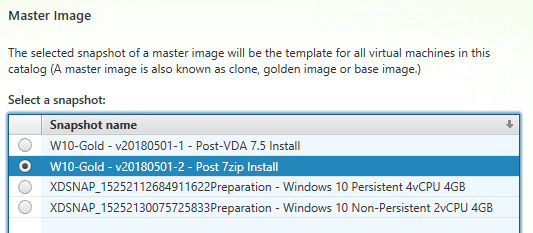
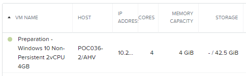
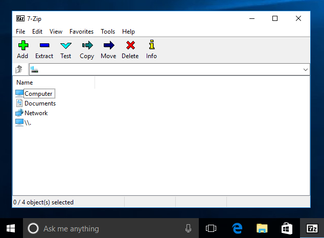
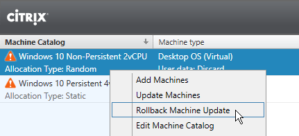

Updating Machine Catalogs
-------------------------

Overview
++++++++

In this exercise you will use perform "Day 2" operations for a XenDesktop environment, including expanding an existing Machine Catalog with more desktop VMs, and rolling out an updated gold image to your non-persistent Machine Catalog.

Adding More Desktops
++++++++++++++++++++

In **Citrix Studio > Machine Catalogs**, right-click your Non-Persistent Machine Catalog and select **Add Machines**.

Specify **1** as the **Number of machines to add** and click **Next**.

Confirm the existing OU and naming scheme and click **Next**.

Review configuration and click **Finish**.

In **Citrix Studio > Delivery Groups**, right-click your Non-Persistent Delivery Group and select **Add Machines**.

Specify **1** as the **number of Machines for this Delivery Group** and click **Next > Finish**.

.. note::

  Double-click the Non-Persistent Delivery Group and observe that the new desktop is powered off. This is due to the Power Management settings configured in :ref:`npdesktops`.

Edit the Non-Persistent Delivery Group **Power Management** to increment the number of powered on machines.

Observe the additional **W10NP-##** VM is then powered on in **Prism** and soon appears Registered in **Citrix Studio**.

Updating the Gold Image
+++++++++++++++++++++++

In **Prism > VM > Table**, select the **W10-Gold** VM and click **Power on**.

Once the VM has started, click **Launch Console**.

In the **W10-Gold** VM console, install or update an application and then shut down the VM.

.. figure:: images/updatecatalog5.png

Once **W10-Gold** is powered off, select the VM and click **Take Snapshot**

Specify a **Name** for the snapshot (e.g. "W10-Gold vYYYYMMDD-X - Installed 7zip") and click **Submit**.

In **Citrix Studio > Machine Catalogs**, right-click your Non-Persistent Machine Catalog and select **Update Machines**.

.. note::

  Update Machines is not an available for your Persistent Machine Catalog as updates to persistent desktops are handled via traditional patch management tools.

Click **Next**.

Select your updated **W10-Gold** VM snapshot and click **Next**.

Fill out the following fields and click **Next**:

- Select **Immediately (shut down and restart the machine now)**
- **Distribution time** - Update all machines at the same time
- **Notify users of the update** - Do not send a notification

.. note::

  These choices are based on wanting to roll out an update as quickly as possible, but note Studio provides maximum flexibility for Rollout Strategy, allowing Administrators to proactively notify users and stagged gold image deployment for large pools over the period of several hours.

Review configuration and click **Finish**.

A new preparation VM will be cloned and booted to prepare the new snapshot.

After the preparation VM is shut down and removed, **Prism > Tasks** will display the changing power state of VMs as they're powered off. After several minutes you'll see VM disk update tasks, which is MCS updating the cloned disk for the provisioned VMs to point to the new prepared snapshot.

.. figure:: images/updatecatalog8.png

Log in to Citrix StoreFront as **NTNXLAB\\basicuser03** and launch your **Pooled** desktop to verify the presented desktop reflects the updated image.

In **Citrix Studio > Machine Catalogs**, you now have an option to rollback your Non-Persistent Machine Catalog to the previous snapshot.

Takeaways
+++++++++

- Adding capacity to an existing Machine Catalog can be done rapidly. Combined with Nutanix's ability to expand a physical cluster with a One Click operation, this enables an IT organization to be very responsive to changing business needs.

.. No vCenter.

- Nutanix creates separate block maps (metadata mapping a vDisk to its corresponding extents) for each new snapshot created, eliminating the additional overhead and read latency common with large snapshot chains traditionally seen in other hypervisors. Gold image management is simplified by not having to mitigate the performance impact of snapshot chains.

- Gold image versioning with MCS can be implemented easily through snapshot naming conventions.
