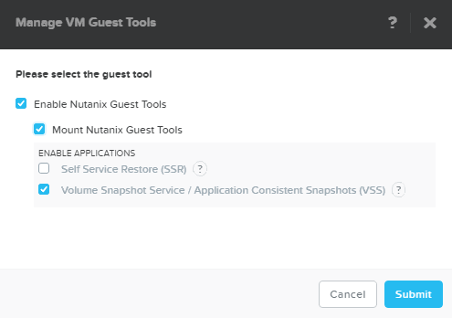
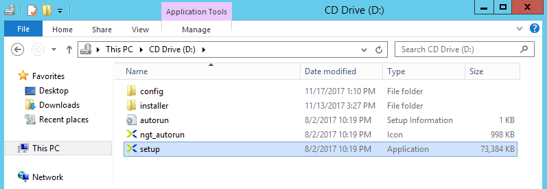
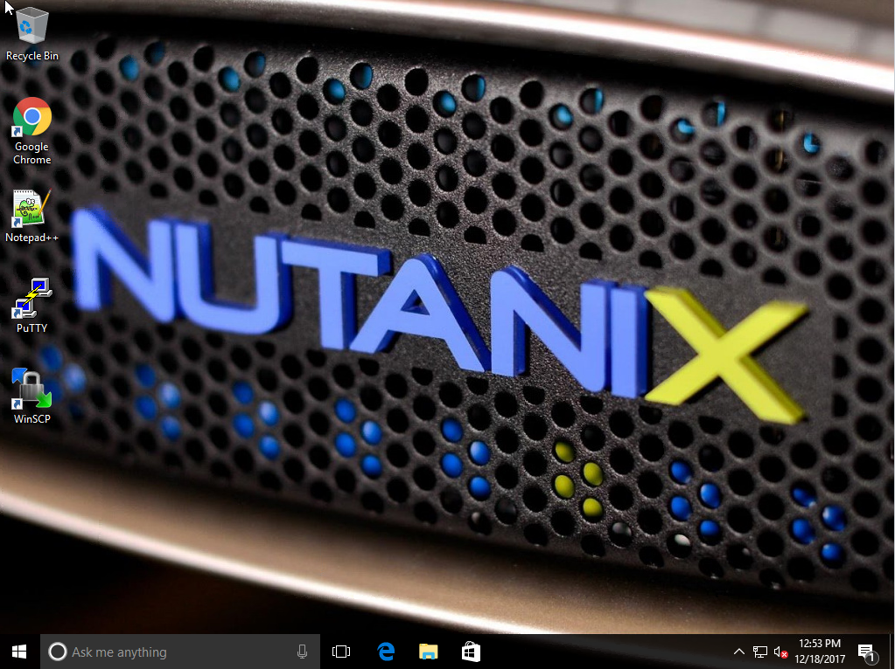
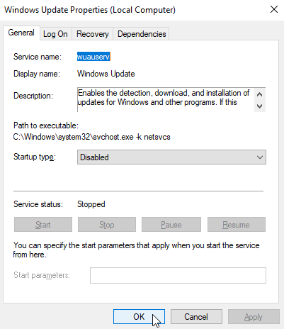
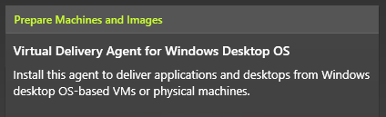
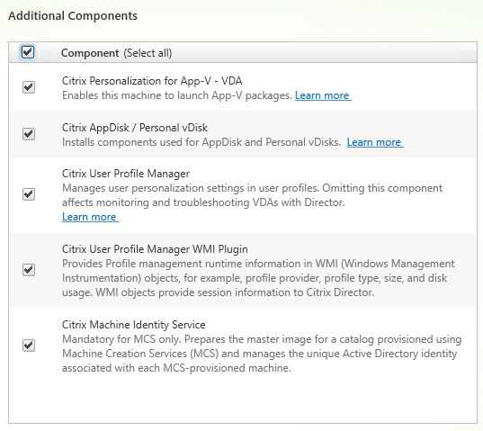
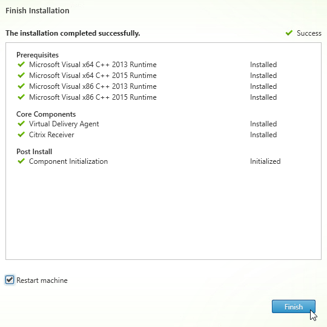
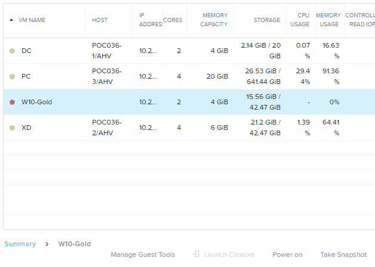
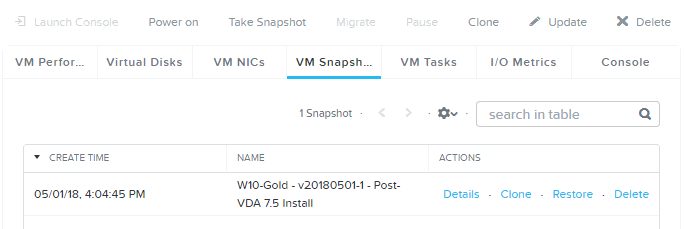

Windows 10 Gold Image
---------------------

Overview
++++++++

In this exercise you will use the Prism to deploy a Windows 10 template image to be used as a Master (often referred to as "Gold") image for XenDesktop. Once the image has been created, you will snapshot the VM in Prism.

Creating the VM (via CLI)
+++++++++++++++++++++++++

Using an SSH client, execute the following:

.. code:: bash

  > ssh nutanix@<NUTANIX-CLUSTER-IP>
  > acli
  <acropolis> uhura.vm.create_with_customize W10-Gold container=Default memory=4G num_cores_per_vcpu=1 num_vcpus=2 sysprep_config_path=https://raw.githubusercontent.com/mattbator/stageworkshop/master/unattend.xml
  <acropolis> vm.disk_create W10-Gold cdrom=true empty=true
  <acropolis> vm.disk_create W10-Gold clone_from_image=Windows10
  <acropolis> vm.nic_create W10-Gold network=Secondary
  <acropolis> vm.on W10-Gold

.. note::

  When using **acli**, you can use the Tab key to autocomplete fields. Pressing Tab twice lists available namespaces and values.

.. note::

  Cloud-Init and Sysprep files can be provided via HTTP(S):// and \NFS://, or can access files directly on a Storage Container via ADFS://.

.. note::

  The `Unattend script <https://raw.githubusercontent.com/mattbator/stageworkshop/master/unattend.xml>`_ will generate a unique hostname, disable the Windows Firewall, and enable Remote Desktop connections.

Select the **W10-Gold** VM and click **Manage Guest Tools**. Select **Enable Nutanix Guest Tools** and **Mount Nutanix Guest Tools**. Click **Submit**.

.. note:: Nutanix Guest Tools can also be mounted programmatically with nCLI. Using nCLI or connecting to <NUTANIX-CLUSTER-IP> via SSH:

  .. code::

      > ncli vm list | grep <VM-Name> -B 2
      > ncli ngt mount vm-id=<VM-Id>

Once the VM has started, click **Launch Console**. Log in with the following credentials:

- **Username** - Administrator
- **Password** - nutanix/4u

In the **W10-Gold** VM console, launch **setup.exe** for the Nutanix Guest Tools installation.

Accept the Nutanix End User Licensing Agreement and click **Install**.

Complete the installation, click **Close**, and reboot the VM.

.. note:: Nutanix Guest Tools can also be installed silently via command line using the following syntax:

  .. code::

      DRIVE:\> setup.exe /quiet ACCEPTEULA=yes

Installing Applications
+++++++++++++++++++++++

In the **W10-Gold** VM console, install any desired applications such as web browsers, text editors, etc.

Disable Windows Updates for your gold image by opening **Control Panel > Administrative Tools > Services**.

Right-click **Windows Update > Properties**.

Select **Disabled** from the **Startup type** down down menu.

Click **Stop**.

Click **OK**.

Installing Virtual Delivery Agent
+++++++++++++++++++++++++++++++++

In **Prism > VM > Table**, select the **W10-Gold** VM and click **Update**.

Under **Disks**, eject any images currently attached to the **ide.0** CD-ROM device and select the **Pencil** icon to change the configuration.

.. figure:: images/w10goldimage5.png

Fill out the following fields and click **Update**:

- **Operation** - Clone from Image Service
- **Image** - XenDesktop-7.15.iso

Click **Save**.

In the **W10-Gold** VM console, open the XenDesktop Installer and click the **Start** button to the right of **XenDesktop**.

Click **Virtual Delivery Agent for Windows Desktop OS**.

Select **Create a Master Image** and click **Next**.

Select **No, install VDA in standard mode** and click **Next**.

Select **Citrix Receiver** (Default) and click **Next**.

Select all **Additional Components** and click **Next**.

Select **Let Machine Creation Services do it automatically** from the drop down menu and click **Next**.

.. figure:: images/w10goldimage9.png

Select **Optimize performance** (`CTX125874 <https://support.citrix.com/article/CTX125874>`_) and click **Next**.

.. figure:: images/w10goldimage10.png

Select **Automatically** to allow the installer to configure the Windows Firewall service to allow traffic for selected XenDesktop components.

Review selections and click **Install**.

Following installation, select **I do not want to participate in Call Home** and click **Next**.

Click **Finish** and wait for the VM to restart.

In **Prism > VM > Table**, select the **W10-Gold** VM and click **Update**.

Under **Disks**, eject the XenDesktop installation .iso attached to the **ide.0** CD-ROM device.

Click **Save**.

Creating Gold Image Snapshot
++++++++++++++++++++++++++++

In **Prism > VM > Table**, select the **W10-Gold** VM and click **Power Off Actions**.

Select **Guest shutdown** and click **Submit** to gracefully shut down the VM.

Once **W10-Gold** is powered off, select the VM and click **Take Snapshot**.

Specify a **Name** for the snapshot (e.g. **W10-Gold vYYYYMMDD-X - Post-VDA 7.15 Install**) and click **Submit**.

Available snapshots and associated actions can be found by selecting the **VM Snapshots** tab under the VM table.

Takeaways
+++++++++

- The gold VM does not require Sysprep or being domain joined.

- Using MCS helps simplify the gold image by not having to manually specify (or depend on Active Directory to specify) what XenDesktop Delivery Controller(s) with which the image should attempt to register. This allows more flexibility in having a single gold image support multiple environments without external dependencies.
