.. _xenapp:

Delivering Applications And Server Desktops
-------------------------------------------

Overview
++++++++

In this exercise you will deploy and configure a Windows 2012 R2 XenApp gold image. Once the image has been created, you will create both the Machine Catalog and Delivery Group. Finally you will test connecting to individual applications and comparing the experience with provisioning full desktops.

Creating the XenApp VM
++++++++++++++++++++++

In **Prism > VM > Table**, click **+ Create VM**.

Fill out the following fields and click **Save**:

- **Name** - XA-Gold
- **Description** - XenApp Gold Image
- **vCPU(s)** - 4
- **Number of Cores per vCPU** - 1
- **Memory** - 4 GiB
- Select **+ Add New Disk**

  - **Operation** - Clone from Image Service
  - **Image** - Windows2012
  - Select **Add**
- Select **Add New NIC**

  - **VLAN Name** - Secondary
  - Select **Add**
- Select **Custom Script**
- Select **Type or Paste Script**

.. literalinclude:: unattend.xml
   :caption: XA-Gold Unattend.xml Custom Script
   :language: xml

.. note::

  The Unattend script will generate a unique hostname and disable the Windows Firewall.

Select the **XA-Gold** VM and click **Power on**.

Select the **XA-Gold** VM and click **Manage Guest Tools**. Select **Enable Nutanix Guest Tools** and **Mount Nutanix Guest Tools**. Click **Submit**.

Once the VM has started, click **Launch Console**. Log in with the following credentials:

- **Username** - Administrator
- **Password** - nutanix/4u

In the **W10-Gold** VM console, launch **setup.exe** for the Nutanix Guest Tools installation.

.. figure:: images/xenapp1.png

Accept the Nutanix End User Licensing Agreement and click **Install**.

Complete the installation, click **Close**, and reboot the VM.

Installing Applications
+++++++++++++++++++++++

In the **XA-Gold** VM console, install a few applications such as OpenOffice, Notepad++, etc.

Disable Windows Updates for your gold image by opening **Control Panel > Administrative Tools > Services**.

Right-click **Windows Update > Properties**.

Select **Disabled** from the **Startup type** down down menu.

.. figure:: images/xenapp2.png

Click **Stop**.

Click **OK**.

Installing Virtual Delivery Agent
+++++++++++++++++++++++++++++++++

In **Prism > VM > Table**, select the **XA-Gold** VM and click **Update**.

Under **Disks**, eject any images currently attached to the **ide.0** CD-ROM device and select the **Pencil** icon to change the configuration.

Fill out the following fields and click **Update**:

- **Operation** - Clone from Image Service
- **Image** - XenDesktop-7.15.iso

Click **Save**.

.. note::

  If not using a fully patched Windows 2012 R2 image, you will need to install Microsoft patch `KB2919355 <https://www.microsoft.com/en-us/download/details.aspx?id=42334>`_ before proceeding with XenDesktop installation (`CTX220340 <https://support.citrix.com/article/CTX220340>`_).

In the **XA-Gold** VM console, open the XenDesktop Installer and click the **Start** button to the right of **XenDesktop**.

.. figure:: images/xenapp3.png

Click **Virtual Delivery Agent for Windows Server OS**.

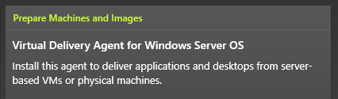

Select **Create a Master Image** and click **Next**.

Unselect **Citrix Receiver** and click **Next**.

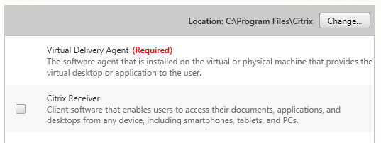

Select all **Additional Components** and click **Next**.

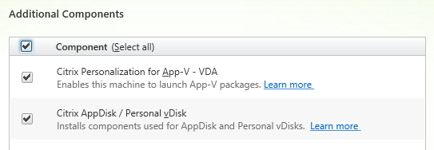

Select **Let Machine Creation Services do it automatically** from the drop down menu and click **Next**.

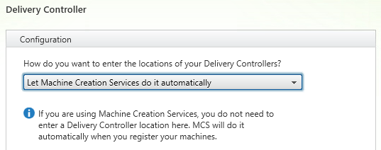

Select **Optimize performance** (`CTX125874 <https://support.citrix.com/article/CTX125874>`_) and click **Next**.

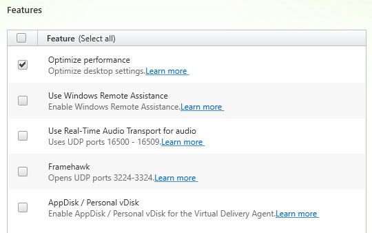

Select **Automatically** to allow the installer to configure the Windows Firewall service to allow traffic for selected XenDesktop components.

Review selections and click **Install**.

During installation of prerequisites you will be prompted to restart the VM, click **Close** and allow the VM to restart. After restart, log in as **Administrator** and the installation will continue.

After installation, select **I do not want to connect to Smart Tools or Call Home** and click **Next**.

Click **Finish** and wait for the VM to restart.

In **Prism > VM > Table**, select the **XA-Gold** VM and click **Update**.

Under **Disks**, eject the XenDesktop installation .iso attached to the **ide.0** CD-ROM device.

Click **Save**.

Creating Gold Image Snapshot
++++++++++++++++++++++++++++

In **Prism > VM > Table**, select the **XA-Gold** VM and click **Power Off Actions**.

Select **Guest Shutdown** and click **Submit** to gracefully shut down the VM.

Once **XA-Gold** is powered off, select the VM and click **Take Snapshot**

Specify a **Name** for the snapshot (e.g. **XA-Gold vYYYYMMDD-X - Post-VDA 7.15 Install**) and click **Submit**.

Available snapshots and associated actions can be found by selecting the **VM Snapshots** tab under the VM table.

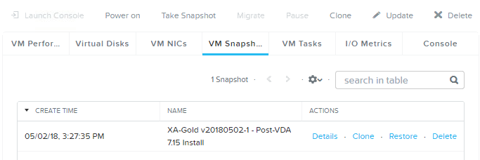

Creating the Machine Catalog
++++++++++++++++++++++++++++

In the **XD** VM console, open **Citrix Studio**.

Right-click **Machine Catalogs > Create Machine Catalog**.

Click **Next**.

Select **Server OS** and click **Next**.

Select **Machines that are power managed** and **Citrix Machine Creation Services (MCS)**. Click **Next**.

.. note::

  As XenApp hosts are traditionally a shared resource across multiple users there is no choice for creating a Server OS Machine Catalog to provide dedicated/static instances.

Select the **Default** Nutanix storage container and click **Next**.

Select your **XA-Gold** snapshot and click **Next**.

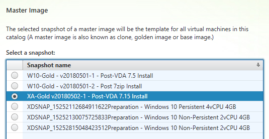

Fill out the following fields and click **Next**:

- **How many virtual machines do you want to create** - 2
- **Total memory (MB) on each machine** - 4096
- **Virtual CPUs** - 4
- **Cores per vCPU** - 1

Fill out the following fields and click **Next**:

- Select **Create new Active Directory accounts**
- Select **XenAppServer** OU
- **Account naming scheme** - XA-##

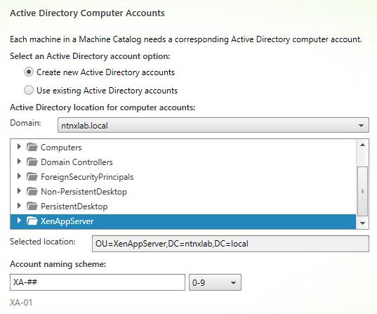

Specify a friendly **Machine Catalog name** (e.g. **Windows Server 2012 R2 XenApp 4vCPU 4GB**) and a description of the image (e.g. what types of applications or teams it will be used for). Click **Finish**.

Similar to the Desktop OS process, MCS will now create and prepare a clone from the **XA-Gold** snapshot.

Upon completion, view the details of the Machine Catalog in **Citrix Studio**.

Creating the Delivery Group
+++++++++++++++++++++++++++

Right-click **Delivery Groups > Create Delivery Group**.

Click **Next**.

Select your **XenApp** Machine Catalog and specify the maximum number of VMs available for the Delivery Group.

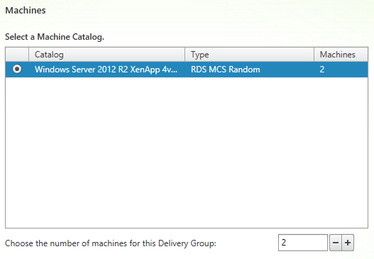

Select **Restrict use of this Delivery Group to the following users** and click **Add**.

Specify **SSP Basic Users** and **SSP Power Users** in the **Object names** field and click **OK**.

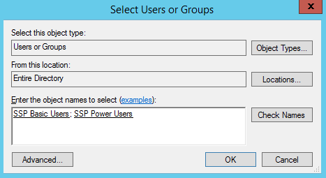

Click **Next**.

Click **Add... > From start menu...**.

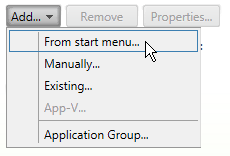

.. note::

  This will boot on of the provisioned **XA-##** VMs and register with the Delivery Controller in order to provide an introspective look at the available applications within that image's Start Menu. You can also enter applications manually provided you know the path to the desired executable.

After the VM registers, select the desired applications and click **OK**.

.. figure:: images/xenapp15.png

Select an application and click **Properties**.

.. figure:: images/xenapp16.png

Note the pre-populated information such as executable path on the **Location** tab. Explore the additional configuration options, such as the ability to add shortcuts to a user's desktop, limit visibility or simultaneous instances (which may be necessary for licensing compliance).

Click **OK > Next**.

Click **Add** and fill out the following fields:

- **Display name** - Shared Windows Server Desktop
- **Description** - Windows Server 2012 R2 RDS Desktop
- Select **Allow everyone with access to this Delivery Group**
- Select **Enable desktop assignment rule**

.. figure:: images/xenapp17.png

Click **OK > Next**.

Specify a friendly name (e.g. **XenApp Delivery Group**) for the Delivery Group and click **Finish**.

Following creation of the pool, observe in **Prism** that all of the **XA-##** VMs been have powered on.

In **Citrix Studio**, right-click your **XenApp** Delivery Group and click **Edit Delivery Group**.

Select the different tabs in the **Edit Delivery Group** wizard and explore the additional configuration options you have available, such as the ability to prelaunch application sessions to speed up application launch time and scheduled XA VM reboots to restore the VM to a freshly provisioned state.

Click **OK**.

Connecting to the Applications/Desktop
++++++++++++++++++++++++++++++++++++++

Open **\http://<XD-VM-IP>/Citrix/StoreWeb** in a browser on the same L3 LAN as your XD VM.

Log in as:

- **Username** - NTNXLAB\\poweruser01
- **Password** - nutanix/4u

Select the **Apps** tab and click an application to launch the session.

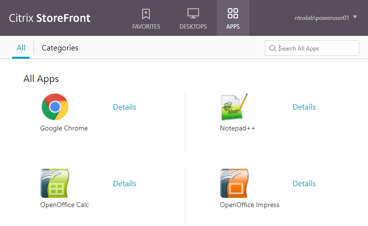

If using the native Citrix Receiver client, note that the application launches and appears as though it were running as part of your local operating system. If using the HTML5 client, note that the application occupies the entire browser tab with no access to the underlying OS.

Return to the **Desktops** tab and launch your **Personal Windows 10 Desktop**.

We'll now configure the Citrix Receiver client to run applications published by our XenApp server farm from inside of the virtual desktop. This is a common use case when providing a single managed OS image to many groups that have different application requirements.

.. note::

  Newer versions of Citrix Receiver do not allow connections to non-secured (HTTP) StoreFront servers by default. Follow the instructions below (`CTX134341 <https://support.citrix.com/article/CTX134341>`_) on your **Personal Windows 10 Desktop** to enable HTTP stores in Citrix Receiver:

  - Open **Command Prompt** as Administrator
  - Run **regedit**
  - Open **HKEY_LOCAL_MACHINE\\SOFTWARE\\Wow6432Node\\Citrix\\Dazzle\\**
  - Set **AllowAddStore** to **A** to allow users to add non-secure Stores
  - Open **HKEY_LOCAL_MACHINE\\SOFTWARE\\Wow6432Node\\Citrix\\AuthManager\\**
  - Right-click **AuthManager > New > String Value**
  - Specify *ConnectionSecurityMode* as the **Name** and leave **Value** blank
  - If Citrix Receiver is running (within your **Personal Windows 10 Desktop**), exit it from the system tray

From within the virtual desktop, open **Citrix Receiver**.

Specify **\http://XD.ntnxlab.local/Citrix/Store/PNAgent/config.xml** as the address for StoreFront and click **Add**.

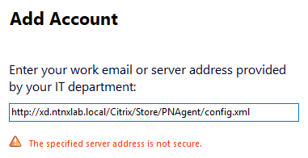

Log in as:

- **Username** - NTNXLAB\\poweruser01
- **Password** - nutanix/4u

Launch an application from the **Apps** tab of Receiver. Note that the application now appears to run as a seamless addition to the underlying virtual desktop.

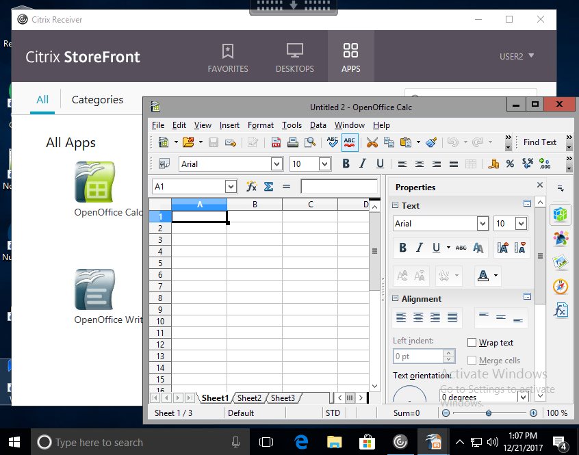

Close your **Personal Windows 10 Desktop** and launch your **Shared Windows Server Desktop**. Shared Server OS based desktops can be a lower cost alternative to VDI due to increased density and simpler Microsoft licensing, but application supportability and user experience could be concerns.

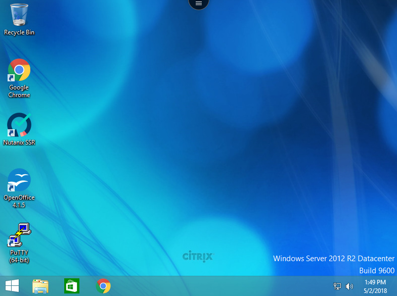

Without disconnecting any current sessions, log into StoreFront as **basicuser01** and launch applications or a Shared Windows Server Desktop.

In **Citrix Studio > Delivery Groups > XenApp Delivery Group > View Machines**, observe multiple sessions from multiple users leveraging the same shared compute assets.

Takeaways
+++++++++

- MCS offers a unified workflow for deploying desktops, desktop applications, server desktops and server applications, all supported by the Nutanix AHV plugin.
